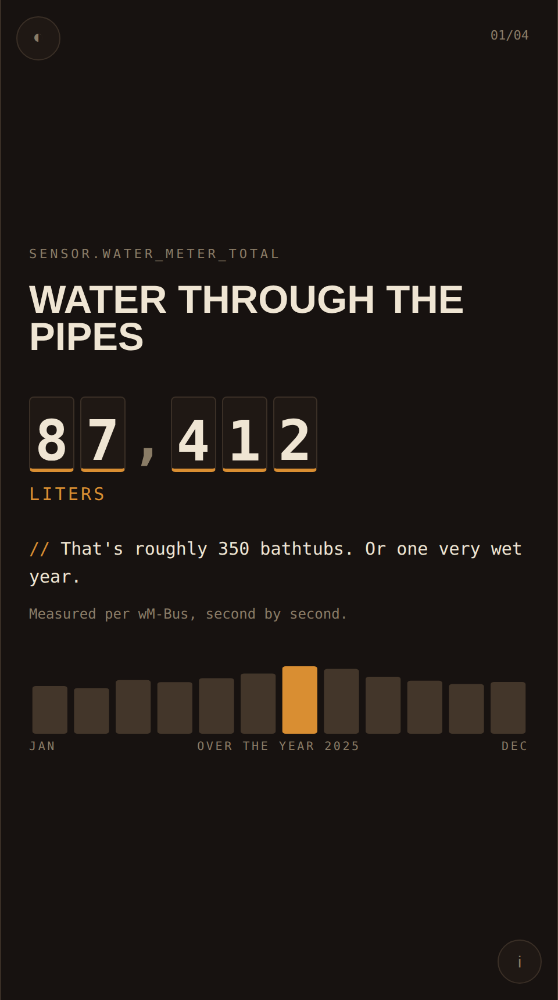

# HA Wrapped

A Spotify-Wrapped-style year review for your Home Assistant. One Python
script pulls a full year of statistics from your instance, optionally lets
an LLM write deadpan one-liners about them, and renders a shareable,
self-contained HTML story — copper look in dark *and* light (follows your
system, toggleable on the page), mechanical odometer digits that roll in
as you scroll, monthly bar charts per stat, and a layout that works on
phones and desktops alike. A built-in status panel (the ⓘ button) shows
what was collected, what was skipped, and whether the AI copy was used.



**[Live demo](https://3djupp.github.io/ha-wrapped/)** — sample data, real scrolling odometers.

> *"Your shutters traveled 4.2 km this year. If this were an elevator,
> it would deserve a tip."*

## What it does

- Pulls **yearly totals** from Home Assistant's long-term statistics over
  the WebSocket API (water, energy, anything cumulative — also averages
  and peaks).
- Counts **state changes** via the REST history API (laundry loads,
  coffees brewed, doorbell rings, shutter cycles, ...).
- Turns counts into fun numbers with a `scale` factor (shutter cycles ×
  window height = travel distance).
- Optionally sends the numbers to the **Claude API** to generate witty
  copy in your language and tone of choice. Without an API key it falls
  back to your plain labels — the page works either way.
- Renders everything into a **single HTML file**. No server, no
  dependencies at view time. Open it, scroll, screenshot, share.

Only aggregated numbers ever leave your network, and only if you opt into
the LLM copy. No entity history is uploaded anywhere.

## Quick start

Grab the config, fill in your entities, create a
[long-lived access token](https://my.home-assistant.io/redirect/profile/)
in your Home Assistant profile, export it as `HA_TOKEN` — then any **one**
of these runs the whole thing:

```bash
# 0) the config (edit it once, the rest is one-liners)
curl -fsSL https://raw.githubusercontent.com/3DJupp/ha-wrapped/main/config.example.yaml -o config.yaml
export HA_TOKEN="eyJ..."                # secrets stay env-only
export ANTHROPIC_API_KEY="sk-ant-..."   # optional, for the witty copy

# uv (Linux / macOS / Windows)
uvx --from git+https://github.com/3DJupp/ha-wrapped ha-wrapped

# pipx
pipx run --spec git+https://github.com/3DJupp/ha-wrapped ha-wrapped

# Docker (builds straight from the repo, writes into the current dir)
docker build -t ha-wrapped https://github.com/3DJupp/ha-wrapped.git
docker run --rm -e HA_TOKEN -e ANTHROPIC_API_KEY -v "$PWD:/data" ha-wrapped

# classic clone (venv — Debian/Ubuntu block system-wide pip, PEP 668)
git clone https://github.com/3DJupp/ha-wrapped.git && cd ha-wrapped && python3 -m venv .venv && .venv/bin/pip install -r requirements.txt && cp config.example.yaml config.yaml && .venv/bin/python wrapped.py
```

Output: `ha_wrapped_<year>.html` in the current directory.
Open `docs/index.html` locally or check the [live demo](https://3djupp.github.io/ha-wrapped/) for a preview with sample data.

### Self-debug

The script prints a preflight status before it fetches anything — config
found, token source, API reachable, AI copy on/off — and a per-entity
summary at the end. The same diagnostics are embedded into the page:
click the **ⓘ** button (bottom right) for the status panel. It shows when
the page was generated, the covered range, which entities delivered data
and which were skipped, and it opens automatically if something is wrong
(it even tells you when you opened the raw, un-rendered template).

## Configuration

Two kinds of stats, both optional, mix freely:

```yaml
statistics:                      # long-term statistics (needs state_class)
  - entity_id: sensor.water_meter_total
    label: "Water through the pipes"
    aggregate: sum               # sum | mean | max
    unit: "liters"
    scale: 1000                  # m3 -> liters
    decimals: 0

counts:                          # state-change counts via history API
  - entity_id: binary_sensor.washing_machine_running
    to_state: "on"
    label: "Laundry loads"
    unit: "loads"
    footnote: "Optional fine print under the number."
```

All top-level options (see [`config.example.yaml`](config.example.yaml)
for the fully commented reference):

| key | default | description |
|---|---|---|
| `ha_url` | — | base URL of your Home Assistant instance |
| `token` | — | HA access token; prefer the `HA_TOKEN` env var |
| `year` | current year | the year to wrap |
| `tz_offset` | `+01:00` | timezone offset for the year boundaries |
| `language` | `en` | language for the generated copy (`en`, `de`, ...) |
| `number_format` | follows language | `en` → 1,234.5 · `de` → 1.234,5 |
| `house_name` | `My Home` | shown on the intro and outro card |
| `theme` | `auto` | `auto` (follow system) · `dark` · `light` |
| `tone` | `dry, witty, deadpan` | personality of the AI copy |

Per-entry options for both lists: `label`, `unit`, `scale`, `decimals`,
`footnote` — plus `aggregate` (`sum`/`mean`/`max`) for `statistics:` and
`to_state` for `counts:`.

## Tips

- Good `counts` candidates: anything with a power-plug-derived
  `binary_sensor` (washing machine, dishwasher, coffee machine, 3D
  printer), covers, doorbells, scene/`input_boolean` activations.
- `scale` is where the fun lives: cycles × meters, brews × cups,
  liters → bathtubs.
- A full year of history for a `counts` entity can take a moment on
  large recorder databases. Long-term `statistics` queries are fast.

## Requirements

- Home Assistant with the recorder (default) and long-term statistics
- Python 3.10+, `websockets`, `pyyaml`, `requests`
- Optional: an Anthropic API key for the generated copy

## License

MIT
